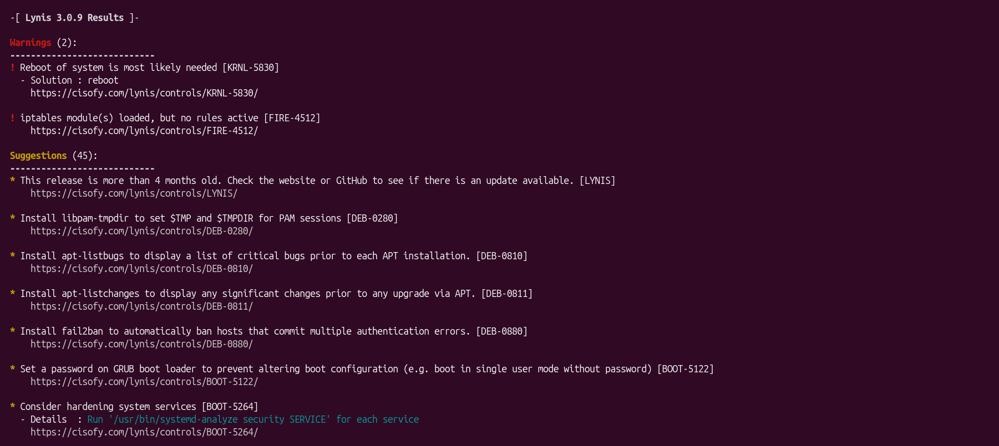
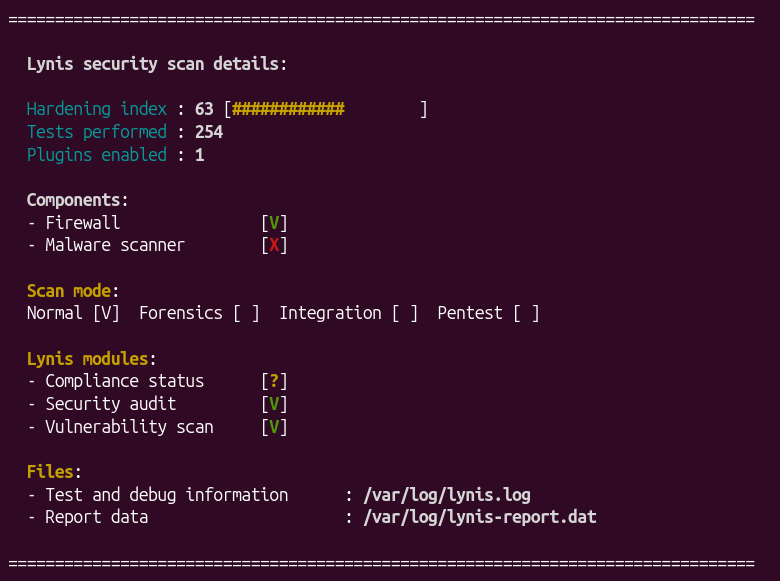
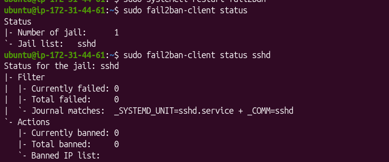
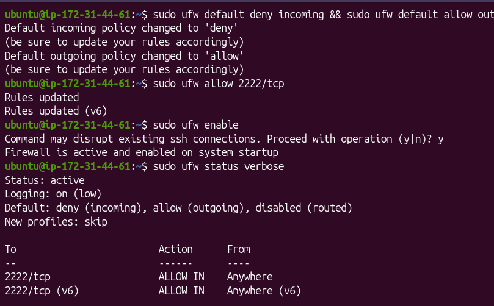
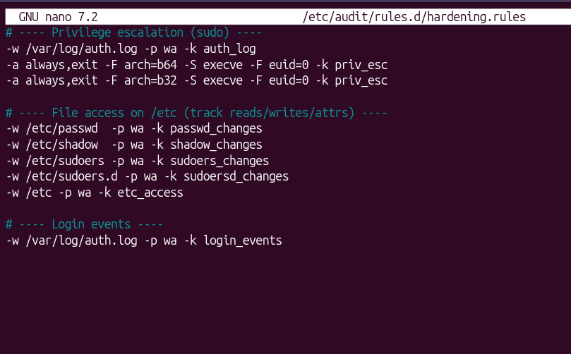
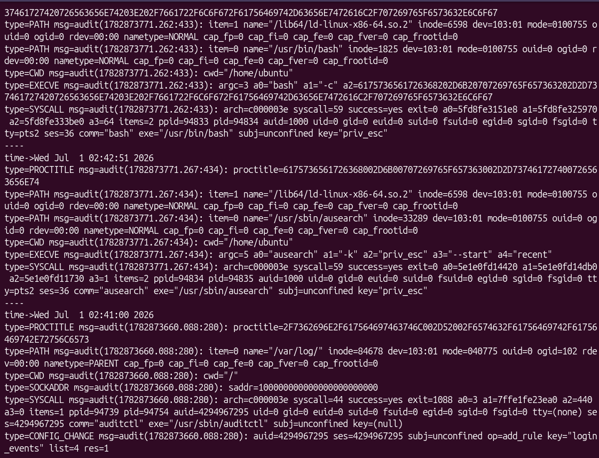

# Linux Hardening Fundamentals (Ubuntu 24.04) — SSH, UFW, auditd

Hardened a fresh Ubuntu server against common attack vectors by enforcing key-only SSH access, adding fail2ban, applying a default-deny firewall with UFW, creating a least-privilege admin user, and enabling auditd rules for login, privilege escalation, and `/etc` file access.

## Badges
- Difficulty: Beginner
- Time: ~2 hours
- Stack: Ubuntu 24.04, SSH, UFW, fail2ban, auditd (Linux audit framework)

## Project Overview
This project mirrors a real-world "secure-by-default" Linux onboarding task for SOC analysts / cloud security teams.

## What I Built (Birds-Eye View)
Key-only SSH access + root login disabled + SSH port changed

Fail2ban to reduce brute-force attempts

UFW allow-list firewall (deny by default)

Non-root admin user (`secadmin`) with controlled sudo access
auditd rules for:
  - privilege escalation attempts
  - file access on `/etc`
  - login events

Centralized audit logging to a dedicated folder

## Tools Used
- `ssh`, `sshd`
- `ufw`
- `fail2ban`
- `auditd`, `ausearch`, `auditctl`
- `lynis` (initial audit)

## Reproducing
See step-by-step instructions in `/docs`:
- `01-initial-audit-lynis.md`
- `02-ssh-hardening.md`
- `03-ufw-firewall.md`
- `04-user-permissions.md`
- `05-auditd-logging.md`

## Key Learnings
- SSH changes have to be validated and reconnected through a second session
- auditd logs need to go somewhere, hopefully a centralized location
- least privilege is easy to create with due diligence

## Credits
Thanks to Bethelhem Beza @ [Missionable](https://missionable.github.io/missions/linux-hardening-fundamentals) for the lab guidance! Keep up the great work!